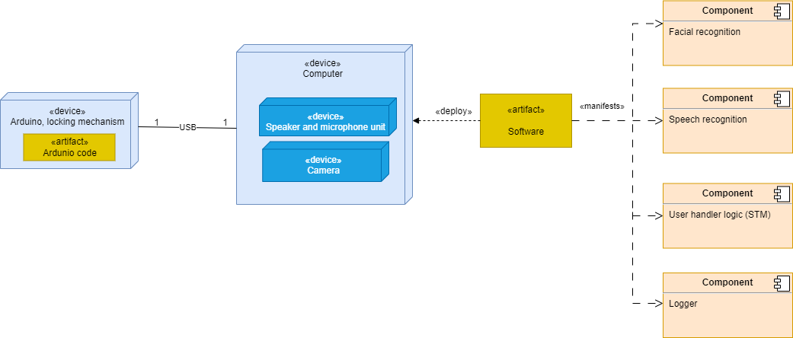
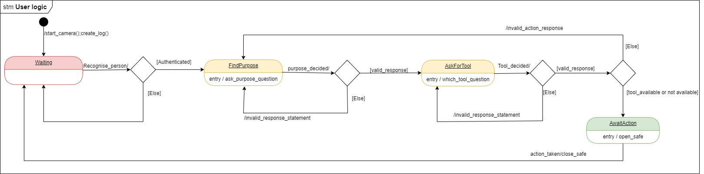
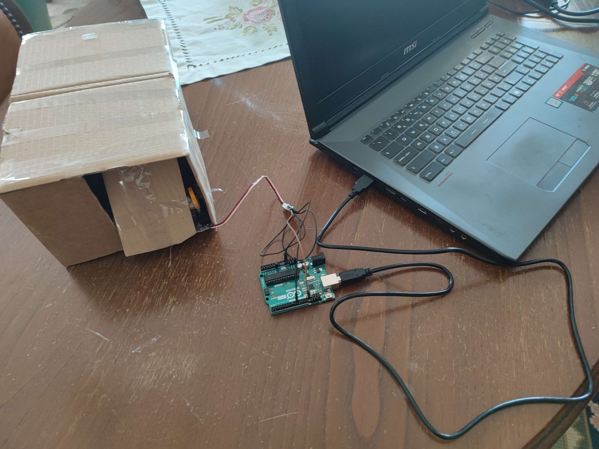
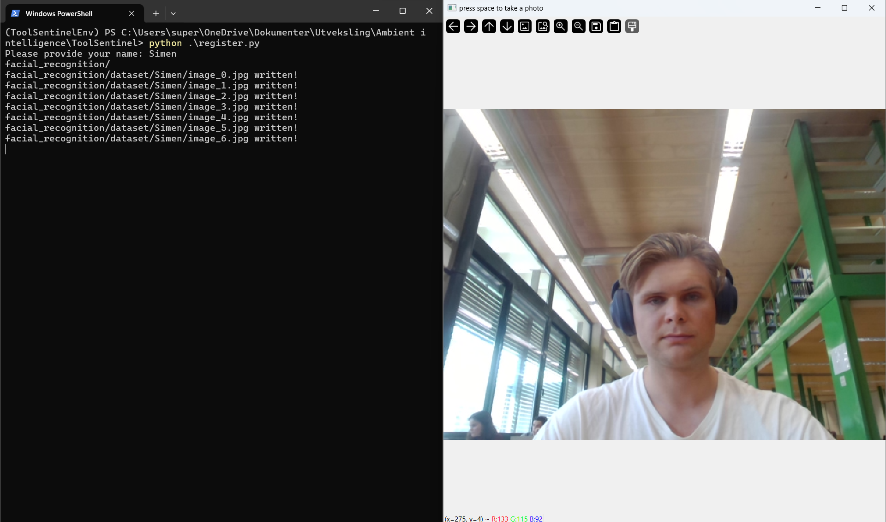
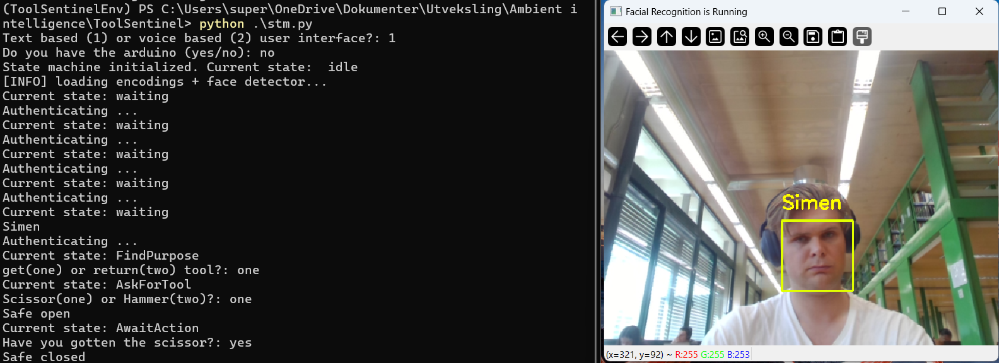
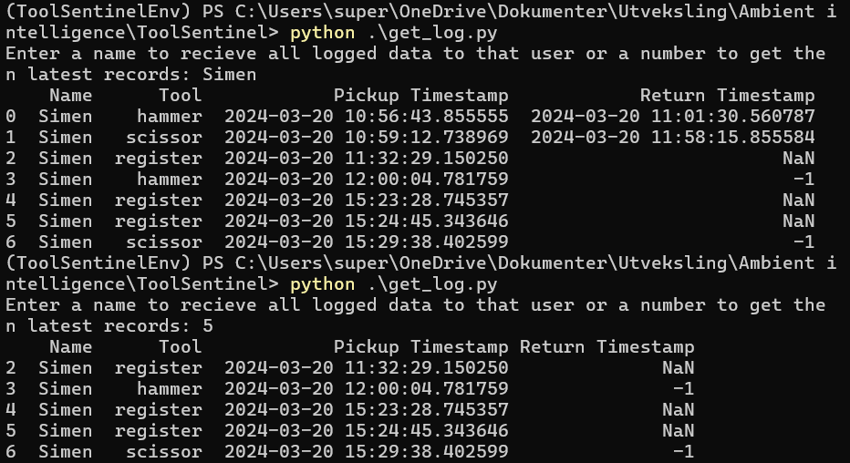

# ToolSentinel
This project is done with the course Ambient Intelligence at Instituto Superior Tecnico. ToolSentinel implements a smart safe that makes access and access control easy by leveraging face recognition and speech recognition. The contributers to this project are (from the left):

- Mário Santos - 99275
- Daniel Gomes - 99195
- Simen Myrrusten - 108924


ToolSentinel has the goal of having simple and secure user interaction with a safe that stores valuable tools for industrial purposes. The users are authenticated using face recognition and can interact with speech. Furthermore, the manager can track back in time of who used what, and when, by checking the logs. This could also be used for checking who is currently possessing each tool. 

The project is a simple prototype of a bigger system initally designed. The project is meant to show the main features, while some implementation steps were not included. In addition, a computer was used to both features (face and speech recognition), due to the lack of a microphone and camera, but also for simplicity. 

## Built with

### Hardware
- Arduino UNO 
- Windows computer

### Software
- Python - implementing stm, face recognition, speech recognition and stm. 
- C - Arduino logic
- Miniconda - For environment management. Dependencies can be found in environment.yaml

For the implemented solution, we have this deployment diagram: 



Finally, we created a simplified state machine to handle the user inputs and call on the right actions and based on user input. The implemented stm can be found below. 




## Setup
This project requires a windows machine and an Arduino kit. It could work on other OSs, but the camera connection might be wrongly configured. The physical setup is illustrated in the image below:



### Dependencies and packages installation

To install the dependencies conda was used. For a guide to install conda, turn to their webpages. You can use this guide:

https://conda.io/projects/conda/en/latest/user-guide/install/windows.html
After installing conda, follow these steps to install dependencies:

1. Clone this repository to your local machine:

   ```bash
   git clone git@github.com:nemisis84/ToolSentinel.git
   ```

2. Navigate to the project directory:

   ```bash
   cd ToolSentinel
   ```

3. Create a Conda environment (optional but recommended):
  
   ```bash
   conda env create -f environment.yaml
   ```

   This will create a new Conda environment with the required dependencies specified in `environment.yaml`.

4. Activate the Conda environment:

   ```bash
   conda activate ToolSentinelEnv
   ```

Make packages out of the folders in the project:

5. Install the project:

   ```bash
   pip install .
   ```

   This will install the project along with its dependencies.

### Arduino Setup

1. Firstly, you need to download Arduino IDE from the official website, according to your computer operating system. Accept all the packages instalations and run the software.

2. Grab the Arduino Uno board and servo, follow the steps:

   - With the use of cables, connect the red entry of the servo to the 5V entry of the board.

   - Connect the black cable of the motor to the ground entry of the board.

   - Connect the white cable of the motor to the pin number 9 of the board.
   
   - Connect the board to the computer, to the USB entry.

3. Go to the Arduino IDE and check the board that is currently selected, if there is none, then select the arduino uno and check the port that it is connected to. Ex: COM3. This value will be used in step 5 so keep it in mind.

4. When the lights turn on the board, copy the code on the file arduino.c and paste it into the Arduino IDE. After that, compile and send it to the board.

5. Finally, check the stm.py file and change the SERIALPORT variable to match the port that you checked on step 3. With this, arduino is set up and ready to go.


## Run project (with demo)

### Register user

First you would need to register a user. To register a user run:

   ```bash
   python register.py
   ```
Insert your name when asked. A camera on your computer will pop up. Press space to take photoes 4-6 should be sufficent. Press esc when you are done. The program will prosess and train the model with the photoes. 



You could add more users later or overwrite your registration using the same name. Please do not register yourself under multiple names. 

### Run safe application


To run the application: 
   ```bash
   python stm.py
   ```
This will start a state machine that will accept handle the user interface, interact with the speech recognition, the face recognition and log the actions. 

You have the option of using it with and without an arduino, and you will be asked about this when the application starts. 

You could also choose between a text based interface or speech recognition. Due to Python's design and our choices, the response time using speech recognition will be significant. We would also recommend in this case to be in quit curcumstances and mute your microphone after your statement. We also mainly use one and two as input as that is easy for the speech recognition to recognize. 

Below is a demo of the text based version. To use the voice based version simply enter 2 instead of one on the first question.



### Check log

For a manager it could be useful to check the log if a tool is missing or broken. To do that run:
   ```bash
   python get_log.py
   ```
You will get the option to enter an integer to recieve the n latest entries in the log or enter a name to get all records to that person. There are three types of entries:
- A tool is specified under the tool column and has a pickup timestamp and a return timestamp. This is tools that have been used and returned.
- A tool is specified under the tool column and has a pickup timestamp and a return timestamp = -1. This is tools that is currently beeing used.
- Under the tool column it says register, which is an entry to when a user is registered to the facial recognition. 

Below you can see an examples of both possible option to get the logs. 



## License
This project is licensed under the MIT license -see the [LICENSE.md](LICENSE) file for details. 

## Acknowledgments

For the facial recgnition we used this open source github repository with some own implementation changes:

https://github.com/carolinedunn/facial_recognition

Thanks to the author Caroline Dunn for providing open source code. 
